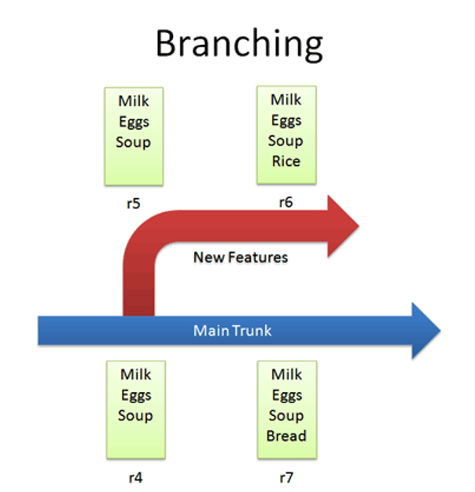
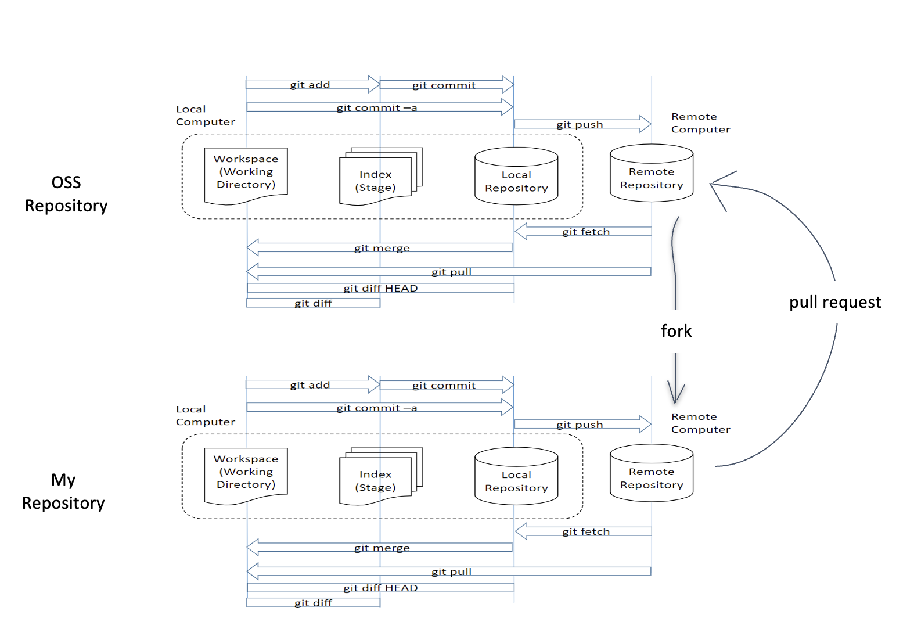
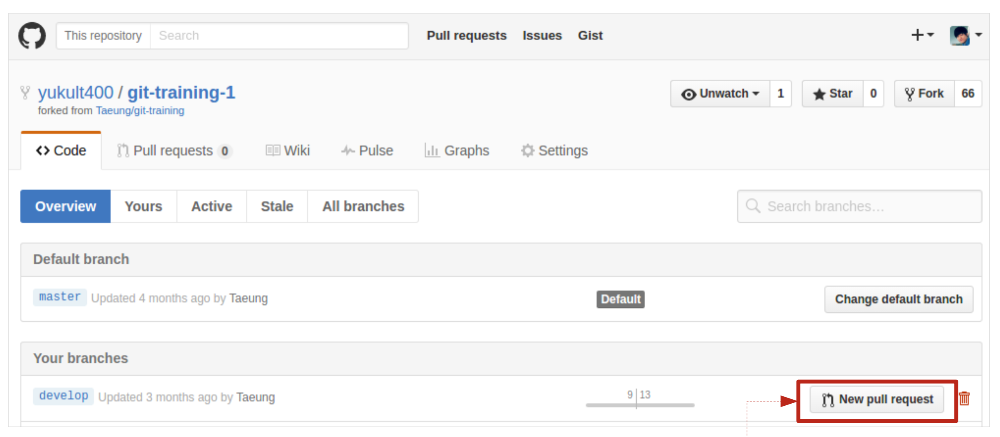

# **오픈소스소프트웨어**

### Introduction
* 담당 교수 : 최광훈
* 담당 학과 : 인공지능학부
* 강의실 : AI융합 - 106
* 강의 시간 : 월1월2수1

-------------
### Week1-1 강의 개요 (강의계획서)
* 강의방식
  1. 동영상 강의를 통해서 **미리 학습**
  2. **매 강의 시작 전** 10분 동안 퀴즈 진행
  3. 요약 강의
  4. 실습 진행

* 학생 평가
  * 중간고사 30%, 기말고사 40%, 개별과제 20%, 수업 참여도 5%, 출석 5%

* 참고 자료
  * [**Haskell MOOC**](https://haskell.mooc.fi)
  * [**최광훈 오픈소스소프트웨어**](https://www.youtube.com/playlist?list=PLhbaMvGyp999F4RqSqCoXetq8OcT1IfJW)
  * [**최광훈 함수형 프로그래밍(MOOC Part 1, 1강-4강)**](https://www.youtube.com/playlist?list=PLhbaMvGyp99_NphAX7k5OqcM1fXLZne8t)

-------------
### Week1-2 오픈소스소프트웨어 개요
### _Introduction to Open Source Software_
1. **What is Open Source Software**?
   * Open Source Software
     * Software whose copyright holder gives the right to publish, use, copy, modify, and distribute the source code to everyone.
   * OSS License
     * The scope of use, reproduction, modification, and distribution rights of the open source software

2. **The difference between Commercial SW and Open Source SW**
   * Commercial SW
     * Individual License, Royalty, Binary only, No reproduction, distribution, and modification, Limited terms and purposes
   * Open Source SW
     * Open Source Lincense, No Royalty, Source code, Reproduction, distribution, and modification are permitted, No limitation on terms and purposes

3. **Philosophical view of OSS**
   * Free Software
     * _Richard Stallman_ – Creator of **GNU Project**  
     

     * FSF (Free Software Foundation, 1984~)
     * Copyleft  (No SW patent, No DRM)

   * Open Source Software
     * _Eric S. Raymond_ – Author of **`The Cathedral and the Bazzar'**  
     
     
     * OSI (Open Source Initiative, 1998~)

-------------
### Week2-1 버전 관리 개요
### _Introduction to Version Control System_
1. **Checkin**
   * Check in a file(list.txt) and modify it over time  
   

2. **Checkout and editing**
   * Check out, edit, and check in a file(list.txt)     
   

3. **Diffs**
   * The trunk has a history of changes as a file evolves.  
   

4. **Branching**
   * Copy code into a separate folder so we can have a separate history of changes  
   

5. **Merging**
   * Merge changes from one branch to another  
   

6. **Conflicts**
   * When changes overlap like an example below  
   

7. **Tagging**
   * Let you tag (label) any revision for easy reference such as ‘Release 1.0’ instead of r4  
   

### _Two Main Types of VCS_

* **Centralized VCS**
  * One central repository with many users
  * E.g., CVS, SVN, Darcs

* **Decentralized (Distributed) VCS**
  * Every user owns his or her local repository
  * A separate remote (central) repository
  * Two new actions (with remote repositories): fork pull request
  * E.g., GIT, Mercurial

-------------
### Week2-2 Git
### _Introduction to GIT_
* **What is Git?**
  1. Who made Git?
     * Linus Torvalds : For collaboration of development of Linux kernel
  2. What is Git?
     * A distributed version control system
  3. Four areas of work in Git
     * Workspace : files you are working with
     * Index: (staged) files to be considered in the next commit
     * Local repository : files committed to the local repo
     * Remote repository : files pushed to the remote repo  
     

* **Workflow of Git**  

-------------
### Week2-3 GitHub, fork, pull request
### _Git / GitHub practice_

* **Git practice**
  1. git init : 해당 폴더를 git 초기화
  2. git add &#60;파일명&#62; : 커밋할 목록에 추가
  3. git commit &#60;파일명&#62; : 커밋하기
     * git commit -m : 커밋 메세지 추가
     * git commit -sm : 서명 추가
     * git commit --amend : 커밋 수정
  4. git status : 상태 확인하기
  5. git diff : 변화분 확인하기
  6. git log / git shortlog : 커밋 확인하기
  7. git remote add origin &#60;URL&#62; : GitHub 원격저장소 저장
  8. git push &#60;원격저장소&#62; &#60;로컬저장소&#62; : 원격저장소에 밀어 넣기
     *  git push &#60;원격저장소&#62; &#60;로컬저장소&#62; --force : 강제로 실행
  9. git reset : add 취소
  10. git reset HEAD~1 : 가장 최근 커밋 지우기

* **How to Fork a GitHub Repository**  

* **How to create a pull request in GitHub**  

-------------
### Week2-4 Git: Advanced topics
### [_How to undo (almost) anything with Git_](https://github.blog/2015-06-08-how-to-undo-almost-anything-with-git/)

* **One of the most useful features of any version control system is the ability to "undo" your mistakes. In Git, "undo" can mean many slightly different things.**

-------------
### Week3 Markdown

1. **Italics and Bold**
   * italic : surround words with an underscore ( \_ )
   * bold : surround words with two asterisks ( ** )
2. **Headers**
   * preface the phrase with a hash mark ( # )
3. **Links**
   * wrap the link text in brackets ( [ ] ) and wrap the link in parentheses ( ( ) )
4. **Images**
   * enter an exclamation point ( ! ), wrap the alt text in brackets ( [ ] ), and then wrap the link in parentheses ( ( ) )
5. **Blockquotes**
   * preface a line with the "greater than" caret ( > )
6. **Lists**
   * unordered list : preface each item in the list with an asterisk ( * )
   * ordered list : prefaced with numbers, instead of asterisks
7. **Paragraphs**
   * inserting two spaces after each new line